# Game Overview

## Core Concept: 

This game will attempt to be a cross a `survival`, `adventure`, `puzzle` and `stealth` game. The player takes on the role of a character heavily addicted to substances.

The game will be an adventure strewn with `pitfalls`, `obstacles` and `challenges` which the player must overcome in order to reach their main goal. The game will take place in an **`active supermarket robbery`** set in the late hours of the night. 

Our character is robbing the store with the intention of `stealing only the most valuable drug` trapped deep within a `maze-like` supermarket. Once the player acquire's his necessity he then is tasked with escaping the building. 

Will he be able to make it out without being caught? Or will he be lost to his own devices in the maze of his own mind as he decends further and further into madness.

You'll __have to play__ to find out..

## Related genre(s) / Games: 

### Maze

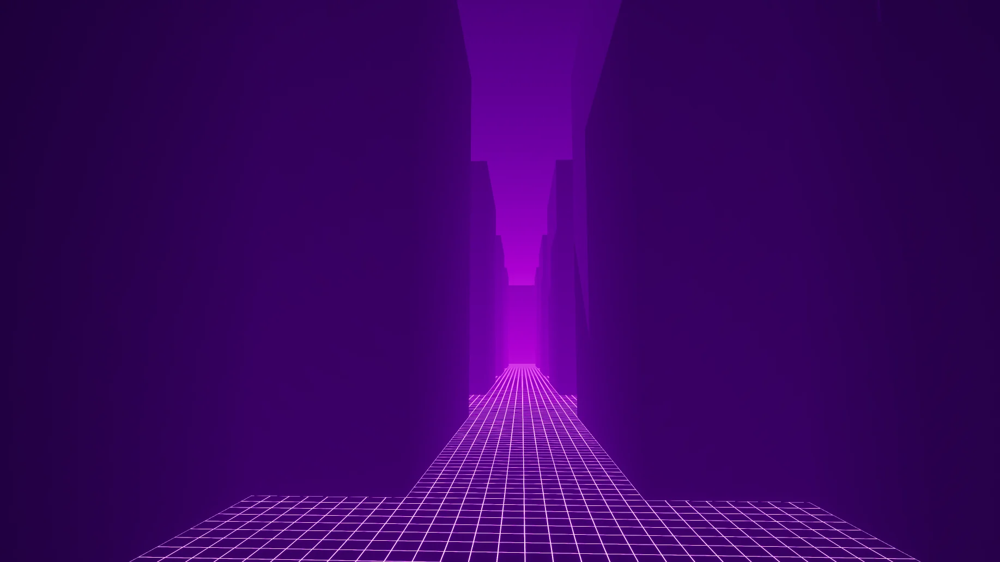

__Maze__ games are puzzles in which the aim is to solve labyrinths. Navigating vast and endless corridors in search of the `centre`, an `objective` or an `exit`. In a typical maze game several levels are available, gradually increasing in difficulty as you go along.

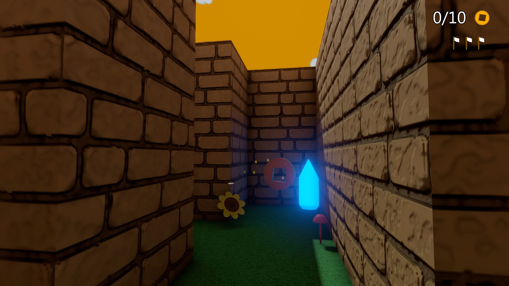

Unlike these games which have multiple maze levels, we will just have the `singular maze`. Inside of this maze we will have `sub sections of the larger maze`.

> [!NOTE]
> As you get closer to your goal and as you get further into this maze it becomes `more and more eerie and weird`

### Antichamber

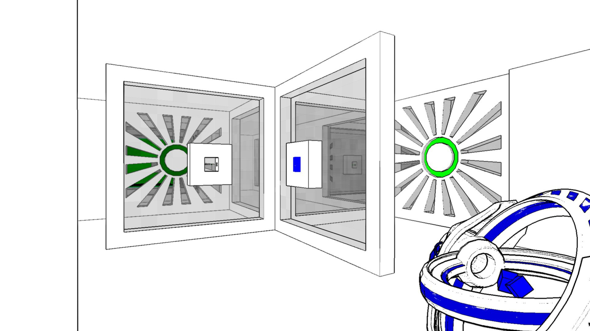

In some ways, Antichamber represents a good example of the game we wish to create. 

> The general atmosphere of incomprehension and puzzles are common to both games.

__Antichamber__ is a first-person game in which the player must solve a `series of puzzles`.

> [!NOTE]
> We want to provide more information about the main player than Antichamber does. For example, we want the player's body to be visible __(more in [player perspective](#player-perspective))__, despite the fact that the game is only played in first person.
>
> Additionally we have a `completely different vibe` that we are going for in terms of our atmosphere and the actual "puzzles" we have to solve being more strategical rather than physics based.

## Target Audience: 

The game we're about to create is aimed at teenagers and young adults. The game will feature content relating to `psychotropic substances` and the physical and mental `"maze"` that is addiction.

> [!CAUTION]
> These characteristics mean that the game is not suitable for a young audience due to the mature themes, messaging and activities performed in the game.

## Unique Selling Points (USPs):

The `eerie atmosphere` that encompasses the game and its challenge / puzzle features is designed to `unsettle players` while still leaving them intrigued enough to make them want to venture deeper into the maze.

The game's mechanics will `help players understand how to finish the game bit by bit`, without allowing them to find all the solutions at once. The player is therefore `expected to fail` and, as the game progresses, to understand how to avoid past failures. 

The incremental nature of the game, and the `progressive learning process`, is designed to provide players with reduced doses of satisfaction. The aim is to keep the player interested and awake to the mysteries of our game for as long as possible `slowing their maze traversal`.

> [!NOTE]
> This process of learning can be compared to the `Dark Souls` type games such as Elden Ring in which completing the objective is `hard but addictive`

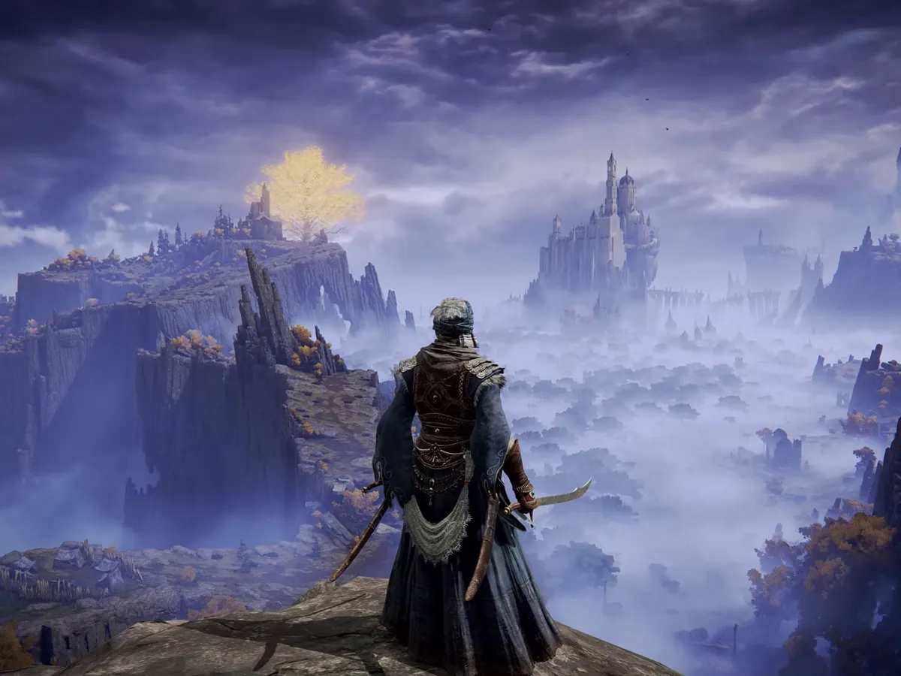

---

# Story and Narrative

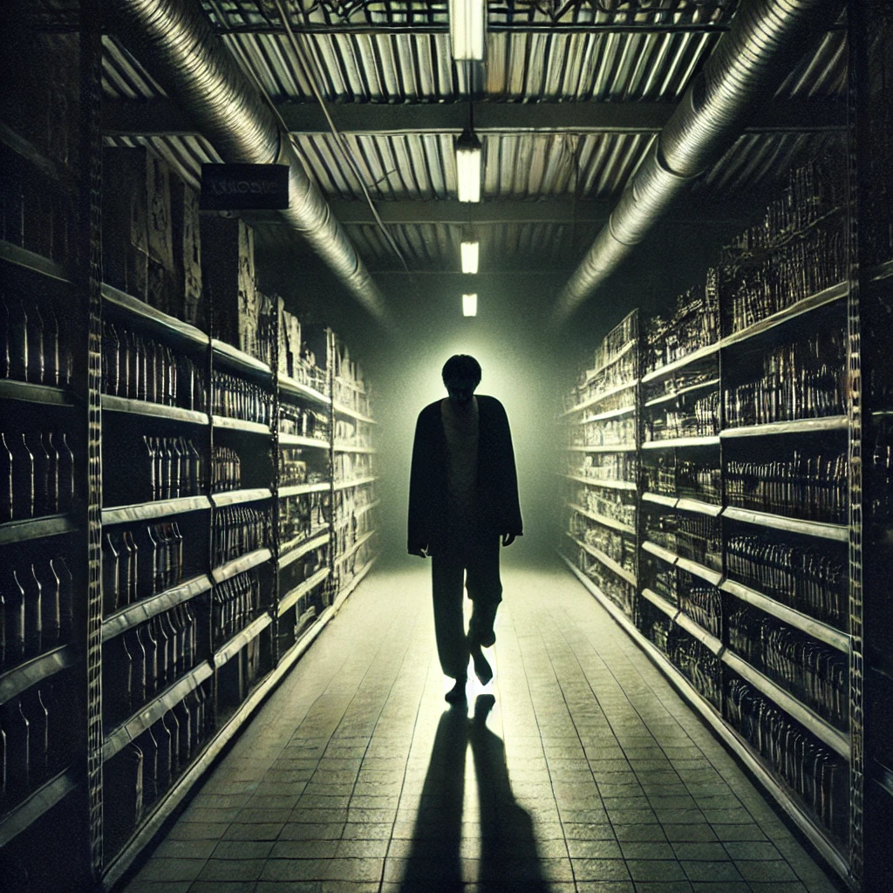

The main character is a nameless, intoxicated male that wants to break into a supermarket to acquire some drugs to fuel his `prolonged and destructive addiction` to break from his `depressive and monotonous lifestyle and soul-crushing job`.

> [!NOTE]
> We hope this experience can be `related to alot of our players` to encourage new players 😊

The game played through the lens of someone that is `highly intoxicated` on `drugs` and aims to replicate their `eerie` and `dark` experience of life, and emphasises the importance and need for drug rehabilitation and mental support.

> [!IMPORTANT]
> We hope players will draw the connection between the `maze of the supermarket` and the `maze of our characters mind` that he continues to walk every day he continues these dangerous and unhealthy habbits.

## Backstory: 

The game is set on a `"spooky" night`, and the main character wants to break into a supermarket and steal some drugs to fuel his prolonged and destructive addiction. 

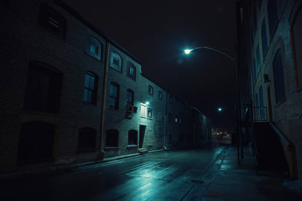

As he enters or breaks in, his intoxicated vision of the supermarket is manifested through the `labyrinth-like grocery aisles`, `security guards`, `security cameras` and his other personal `drug-induced hallucinations` of obstacles in his way.

The main character must find his way past these challenges whilst navigating around the seemingly endless supermarket aisles, to find the aisle that contains his `highly prized substance`.

Assuming that the player plays the game as intended, at the end, the character could reach an exit, and the final moments of the game are played through the lens of a completely normal, sober cashier who is serving someone who seems to be completely normal, `emphasising the subtle traits of mental illness`. 

However, `alternative endings` may be explored depending on the options that the player might take and whether or not it's technically feasable within the timeframe. For instance, instead of acquiring detrimental substances such as alcohol, the player might choose to `acquire a bottle of water`, which could end up sobering the main character, clearing their world up and removing hallucinations.

> [!NOTE]
> Could be something of a `secret ending / easter egg`

## Characters: 

Other than the main character, there are oddly looking security guards that carry flashlights that actively `act as obstacles` in the game, where if the player was to be caught by this light, they’ll lose.

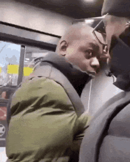

Spotted around the supermarket are ‘eerie’ looking NPC grocery store customer hallucinations whose heads are `always staring at the character`, but as soon as the main character looks at them, their head faces back at whatever grocery products they were browsing through. They merely add to the ‘eerie’ atmosphere of the heavily hallucinated and intoxicated world of the main character. They may also have some dialogue or even ‘eerie’ voice acting.

> [!NOTE]
> Similar to the above gifs it should feel unsettling to the player but `not outright scary`

There may be some `quick time events` that are activated or triggered, causing hallucinated security guards to walk down the current aisle of the character. In such an event the character must find a quick place to hide or crouch in the supermarket to avoid getting caught/captured. For e.g., the main character might need to hide in one of the empty freezers in the freezer section to escape. 

<!--- Villains or bosses may be introduced in the game to enhance the intensity of the gameplay and heighten the ‘eerie’ intoxicated world of the protagonist. These bosses will be specific to each type of aisle the player is in, for instance, the produce aisle a ‘Produce poltergeist’; A floating, ghostly figure made of swirling fruits and vegetables. Its body is constantly shifting, with apples, bananas, and other produce forming its limbs and head. Its eyes are glowing orbs hidden inside rotting pumpkins, and its voice is a cacophony of market sellers shouting prices. These monsters will have unique voice acting and boss fight mechanics. --->

<!--- I think this is too horror esk for the spec Thomas so I've blanked it out as a comment --->

---

# Gameplay and Mechanics

## Player Perspective: 

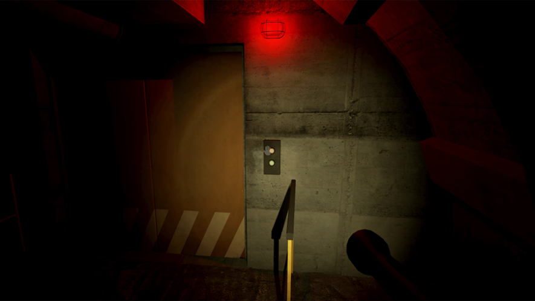

Our game will be set in the `first person` with a `limited heads up display` to maximise game immersion.

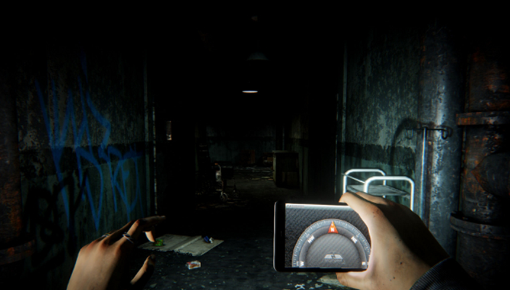

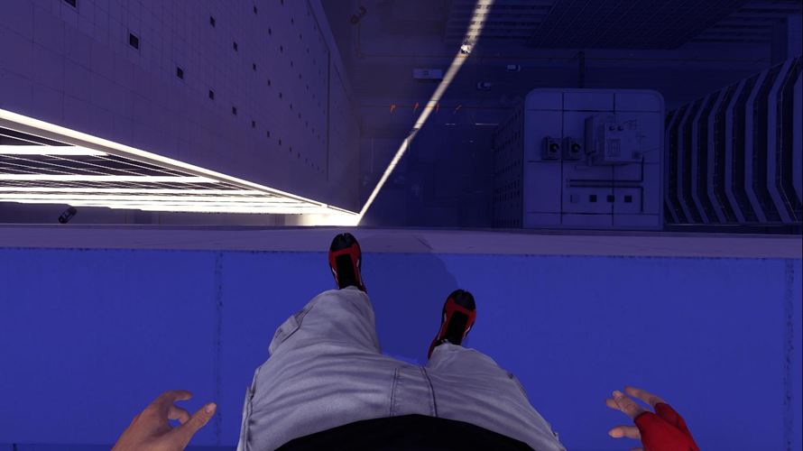

As the player you will `control a camera attached to our character model`. Looking down you will be able to see the rest of your body, lower chest, hands, legs. These will dynamically move depending on if the player is running, walking or crouching.

## Controls: 

Basic character movement will be `forward`, `back`, `left`, `right`, `jump`, `sprint` and `crouch` mechanics to help the player to manoeuvre different obstacles found in the store to help them to reach their goal.

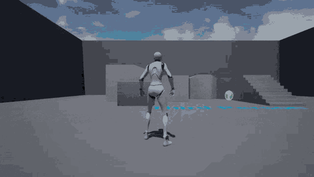

> [!IMPORTANT]
> __Our game is not set in the third person__ this is just to portray movement.

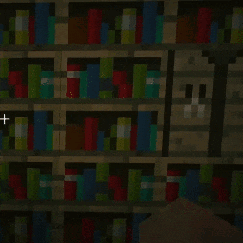

> [!NOTE]
> The above gif although from a sandbox game portrays a similar movement mechanic we wish to include. A `sneak` / `crouch`

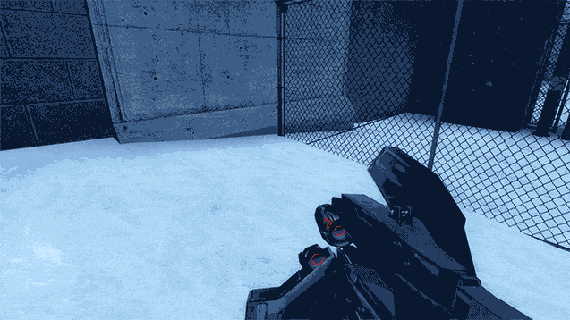

Additionally, players will be able to `pick up` and `drop` items. This could range from `psychedelics` to `handy tools` to help to pass obstacles. The player may also store these items in an inventory.

> [!IMPORTANT]
> This inventory will be very limited to promote player `strategy` and `sneakieness` over a brute force approach. They would only be able to use the select few items that they can carry through the maze and would thus need to `choose wisely`

## Progression:

## Gameplay Mechanics:

| **Game Mechanic**                         | **Explanation**                                                                                                                                   |
|-------------------------------------------|---------------------------------------------------------------------------------------------------------------------------------------------------|
| **Solvable maze with concrete goal**      | The core mechanic involves navigating through a procedurally generated maze to find and steal drugs. The goal provides clear objectives and progress. |
| **Drug effects**                          | Drug effects alter the player's perception and abilities, introducing variability and challenges. They fit the theme by simulating the protagonist's addiction. |
| **Inventory**                             | Players manage limited inventory space for tools, drugs, and other items, adding strategy and resource management to the gameplay.                   |
| **Light effects**                         | Dynamic lighting creates an eerie atmosphere, making the maze more challenging by obscuring paths or revealing hidden routes.                       |
| **Mirror effects**                        | Mirrors can distort reality, disorienting the player and creating uncertainty, enhancing the unsettling theme of the game.                          |
| **Frequent respawns and new maps**        | Procedural generation of new maps and respawn points keeps the gameplay fresh, unpredictable, and engaging, ensuring replayability.                 |
| **Guards and Obstacles**                  | Security cameras, guards, and blocked paths create tension and challenge. Players must avoid detection or overcome obstacles, fitting the theme of stealth and evasion. |

> [!IMPORTANT]
> These mechanics may not necessarily represent the final finished game depending on time / hardware restraints

---

# Levels and World Design

## Game World:

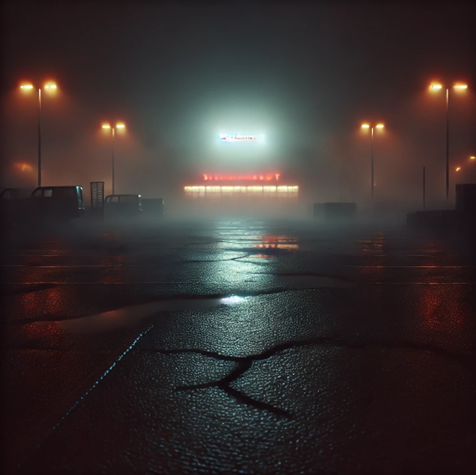

The player begins outside a `dimly lit supermarket at night`. The air is `thick with tension` and the `world is cloaked in fog`. The user can see the supermarket in a distance by the slight neon light coming out from the supermarket. The background of the world gives only a faint glow of streetlights. 

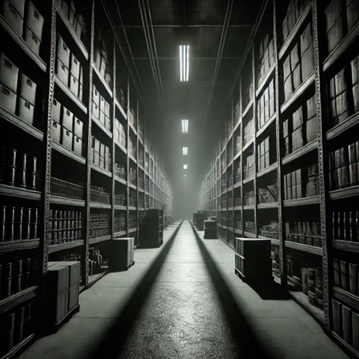

Inside the supermarket, the `sight of the player narrows`, making the environment feel like a wasted building akin more to a warehouse than a supermarket. The aisles of shelves create a maze-like layout, with towering racks of goods making shadows in the background. 

> [!IMPORTANT]
> The game would be a first-person 3D game where the player navigates through a limited open-world by walking around with a limited sight. No map will be provided to increase the player's game experience. 

## Objects:

There are supermarket shelves, where it is very tall, loaded with various goods, some items on the shelves would be scattered or fallen onto the ground. These shelves create the `maze-like structure` of the supermarket and also act as a barrier for the player to hide in order to hide from the security cameras and patrolling guards. The `shelves also block the light from the guard's flashlights` and `camera’s views`, which creates `pockets of darkness`.

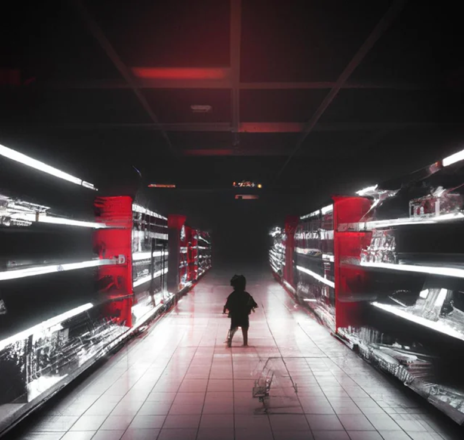

There will be `security cameras`, mounted on the ceilings or high on walls, they are `imposed as a ray of white light`, they will be moving constantly with a small range of motion. If a player walks onto and gets caught by the light of the camera, the alarm will go off, making a loud emergency sound, and the patrolling guards will know your location and rush towards you, decreasing your chance of escaping and thus losing the game more easily.

There are guards `patrolling inside the supermarket`, they are all carrying a flashlight. Their faces will never be seen, the only indication of their presence would be the `red ray from their flashlight`,  which adds to the eerie nature of the game. The guards patrol the supermarket along the maze(shelves). Players must evade the guards by `staying out of sight of their flashlight`, if the player gets spotted, the player loses the game if the player cannot get out of sight of the guard in a 3 seconds limit. 

> [!NOTE]
> Getting discovered and located by the camera __`does not make the player lose the game`__ yet, it is only when spotted by the flashlight of the guards and being in sight for 3 seconds that will cause the player to lose.  

There could be `spider webs` or `gum` on the floor, they are barely visible because of the limited sight for the player. Once the player steps on the spider web, `their walking speed will decrease` and make it hard to move. 

Finally there will be drugs spread around the supermarket, some on the floor, some on the shelves. They are made to be hardly visible so that players need to search thoroughly in order to find them and take in the effect of the drug. There will be a few types of drugs, examples are: a drug which makes the player more intoxicated and thus causes a worse sight and illusions, one `“awakening”` drug where the player could sober up and have better vision in the world, one `“happy”` drug which will be the goal object to be obtained in this game etc.

## Physics:

Our game obeys the `physics of our human world`. Mostly human physics are applied in the game, the walking of our player, the patrolling `guards will move as how a human walks`. There will be lights from the security camera and from patrolling guards’ flashlights, causing `shadows and reflections of shelves and things inside the supermarket`. 

> [!NOTE]
> One exception would be the illusion seen by players when they take the wrong drug and become intoxicated, `inducing an illusion that objects do not follow the laws of physics`, objects could be floating, walking on the rooftop etc… 

---

# Art and Audio

## Art Style:

The art style of the game is characterized by a `limited color` palette, predominantly featuring `darker tones` that create a `somber and unsettling atmosphere`.

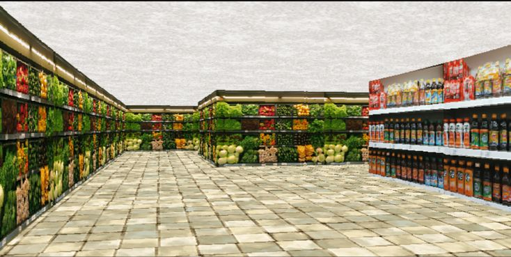

The overall aesthetic is homogenous, reflecting the disoriented and fragmented experience of being `inside the mind of a drug addict`. The game takes place within the maze-like aisles of a supermarket, where the environment is designed with `low poly models`, enhancing the surreal and distorted perception of reality.

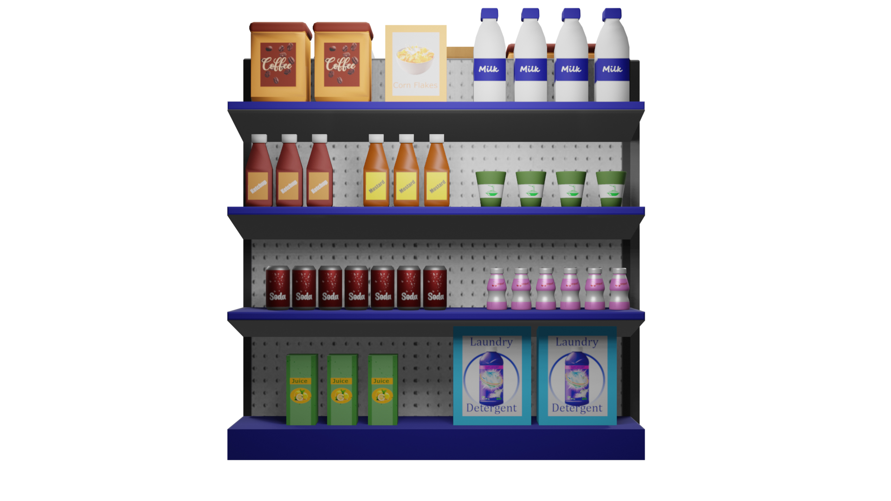

> [!Note]
> The sort of `"low poly"` we're going for

The combination of these elements crafts an eerie and claustrophobic visual experience that immerses players in the chaotic and disorienting world of the protagonist.

## Sound and Music:

The sound design of our game is `quiet`, and creates an atmosphere of eerie calmness. The absence of music accentuates the `unsettling experience`, allowing the ambient supermarket sounds to be the main noise heard.

[Inspiration is a game called `Phasmophobia` and the quite drone heard when entering a house](https://www.youtube.com/watch?v=bz4MuYw8FBA)

> [!IMPORTANT]
> Once again the game is `not in any way` meant to be a horror game. Just eerie.
> This one particular trait of a horror game used to establish an atmosphere we found extremely interesting.

Hallucination noises, like `whispers` and `gibberish`, contribute to the game's unsettling tone. These `increase in frequency` with `more consumed drugs`. Occasional sounds of refrigerators and bottles dropping further enhance the atmosphere. 

These elements should help immerse players in an environment that `emphasizes isolation` and `psychological tension` that sadly comes with drug abuse.

## Assets:

For asset creation / gathering we will use two main resources

> For specific model / asset creation we're unable to outsource

[Free 3D](https://free3d.com)

> Free assets and models online

---

# User Interface (UI)

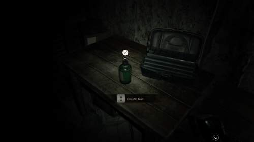

For the UI / User Hud we plan to go very minimalistic with it. Similar to the above Resident Evil 7 Hud

> [!NOTE]
> Pickup indicators will appear when the player is `close enough` and `looking at` an interactable object

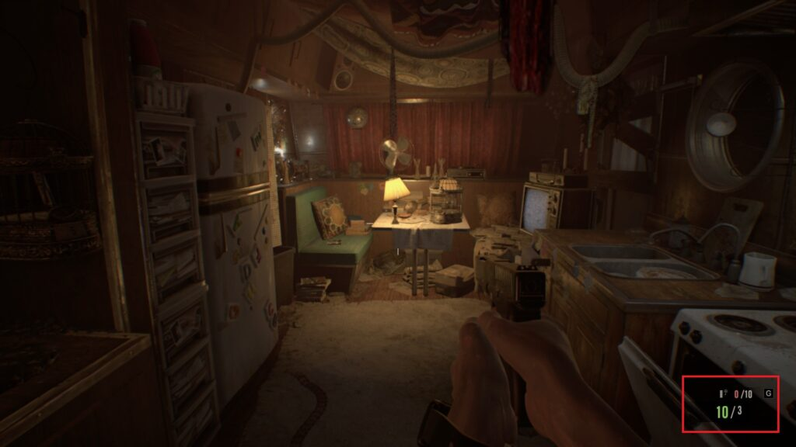

Current item selected will appear in the `bottom right of the screen as above`. Appears as a subtle icon.

> [!IMPORTANT]
> There will be no healthbar however there will be a minimalistic `intoxication bar` to indicate the level of intoxication of the player. `Increasing this bar increases the hallucinations`.

---

# Technology and Tools

> Blender

> Github 

> Audacity

> Unity

---

# Team Communication, Timelines and Task Assignment

## Communication Channels
- **WhatsApp**:
  - **Purpose**: Daily check-ins, quick updates, and urgent communications.
  - **Usage**: 
    - Group chat for overall team discussions.
    - Individual chats for specific issues or updates.

## Task Distribution

1. **Map Design & Building**
   - **Assigned To**: `Riley`
   - **Responsibilities**:
     - Design and create the layout of game environments.
     - Develop and integrate various map elements.
     - Ensure maps align with the overall game aesthetic.

2. **Characters Movement**
   - **Assigned To**: `Theo`
   - **Responsibilities**:
     - Implement and refine character movement mechanics.
     - Develop animations and controls for smooth character interactions.
     - Test and adjust movement to ensure a seamless gameplay experience.

3. **Game Music**
   - **Assigned To**: `Thomas`
   - **Responsibilities**:
     - Create or source background music and sound effects.
     - Ensure music fits the game's atmosphere and enhances player immersion.
     - Implement music into the game, adjusting volume and triggers as needed.

4. **Lighting/Background Design**
   - **Assigned To**: `Jonas`
   - **Responsibilities**:
     - Design and implement lighting schemes to enhance the game’s mood.
     - Create and integrate background elements that support the game’s theme.
     - Ensure lighting and backgrounds contribute to the overall aesthetic.

---

# Possible Challenges

# Potential Difficulties and Solutions

## 1. Plagiarism or Dishonest Work
- **Potential Issue**: Team members might use unauthorized resources or fail to contribute fairly.
- **Plan to Address**:
  - Implement a code of conduct that emphasizes academic integrity and transparency.
  - Use version control systems (e.g., Git) to track contributions and identify any discrepancies.
  - Conduct regular reviews of work to ensure originality and proper attribution.
  - Set up clear expectations for each team member's responsibilities and contributions.

## 2. Physics of the Game
- **Potential Issue**: Developing and implementing realistic and smooth physics may present technical challenges.
- **Plan to Address**:
  - Prototype key physics elements early in development to identify potential issues.
  - Utilize physics engines and tools within the development platform (e.g., Unity’s built-in physics).
  - Collaborate with team members experienced in game physics for guidance and troubleshooting.
  - Schedule iterative testing and refinement to address physics-related issues as they arise.

## 3. Time Collision with Project Deadlines in Other Subjects
- **Potential Issue**: Conflicts between game development deadlines and deadlines for other academic or personal commitments.
- **Plan to Address**:
  - Create a detailed project timeline with milestones to manage deadlines effectively.
  - Use project management tools (e.g., Monday.com, Trello) to track progress and adjust schedules as needed.
  - Communicate with professors or supervisors about potential conflicts to explore flexible solutions.
  - Prioritize tasks and allocate team resources based on project urgency and deadlines.

## 4. Team Communication
- **Potential Issue**: Ineffective communication within the team could lead to misunderstandings or coordination problems.
- **Plan to Address**:
  - Establish regular team meetings to discuss progress, challenges, and updates.
  - Utilize communication tools (e.g., WhatsApp) for quick updates and ongoing discussions.
  - Implement a project management tool to keep everyone informed about tasks and deadlines.
  - Encourage open communication and feedback to ensure all team members are aligned and issues are promptly addressed.

## Prototyping and Testing
- **Plan**:
  - Develop prototypes for key game features and mechanics early to test and refine them.
  - Schedule testing milestones to evaluate and address any difficulties as they arise.
  - Use feedback from testing to make iterative improvements and ensure the game meets quality standards.

