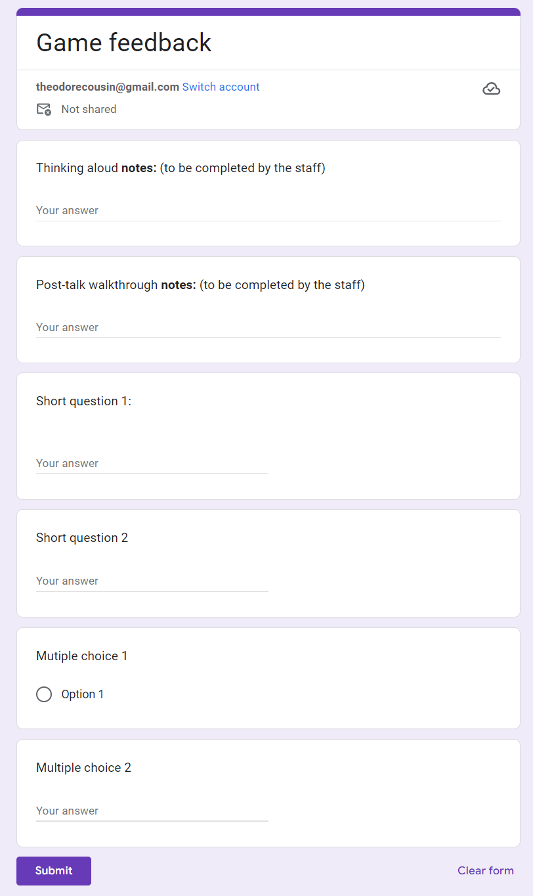

## Evaluation Report (Plan):

### Which evaluation techniques will you use and why? What tasks will you ask participants to perform?

Observational methods:
* Thinking aloud: since our game is a puzzle game, it would be interesting to understand the way of thought of the players. This will help us find out if the levels are too easy/ complicated and how  to improve them.
* Post-talk walkthrough: We might use this method to get specific feedback on the games. This could help us gather information about corner cases of critical features that we need to improve.

Query techniques:
* Structured interview: We’ll ask a set of questions to the participants to understand how they felt while playing our game. These questions will help us to make the game even more eerie. This part of the evaluation will be done just after the post-talk walkthrough (during discussion time).

We will ask the participants to do the following parts of the game:
* Intro
* Level 1
* Finish

Which includes more precisely the following set of tasks:
* Use interactive objects, Experiment the effects related to the objects
* Move objects from the context to complete levels (i.e. barrels, vents, …).
* Move in the map

---

### Participants: How will you recruit participants? What qualifying criteria will you use to ensure that they are representative of your target audience?

Since our game is aimed at teenagers and young adults, we are mainly going to ask friends to test the game for us. In fact, most of our acquaintances are between 18 and 25 years old, which correctly represents our target audience. We're going to diversify the sample of testers we contact as much as possible. Whether in terms of gender, age or the studies/work these people exhibit.

The main recruitment method we'll be using is word-of-mouth. We're going to ask people around us if they'd be willing to help us test our game for an hour or so. 

### Data collection: What sort of data is being collected? How will you collect the data? What tools will you use?

Since we have several methods for collecting feedback, the types of data that will be collected will be multiple:
* Open answers
* Multiple choice answers
* Short answers
* Rating (for instance out of ten) metrics

Data will be collected in two stages. Firstly, a member of the development team will take note of the observations made during the test period. This first section consists of several open fields that allow unlimited text entry. In this way, we'll be able to be exhaustive and describe everything we see during this first phase.

In the second phase, we'll ask participants to fill in a form comprising short questions and multiple-choice questionnaires. This second set of feedback will be much easier to analyze than the first. However, it won't allow us to go into as much depth.

As for the medium we're going to use, we need a versatile system that allows us to collect feedback of all kinds. We're going to use Google Forms, as this platform gives us easy access to responses and enables us to display statistics directly on testers' answers.

### Timeline: What is your timeline for completing the evaluation? When will you make changes to the game?

We expect to interview each candidate for approximately one hour. This hour will be divided into 30 minutes of game testing, 15 minutes of oral interview and 15 minutes for the participant to complete the questionnaire.

The test period will be spread over a short week (about 5 days). Results and trends will be analyzed within two days of the test period. 

Modifications to the game itself will begin immediately after the results have been analyzed.

### Responsibilities: Who is responsible for each task? How will you ensure that everyone contributes equally?

We plan to share the results equally between all developers. Indeed, since each interview will take around 1 hour, it will be complicated to do a large number per participant.

Designing the questionnaire and the interview that will follow the test period is a task in its own right, and will be carried out by one of the developers.

Another developer will analyze the results and understand the trends. This will be followed by a group discussion to identify how this feedback can be incorporated into the game.

Modifying the game will be a joint task.

Within our Group, we operate on the basis of empowerment and trust. We know we can count on each other. When tasks are identified and distributed, each member is responsible for completing the task or communicating his or her inability to complete it on time.

## Evaluation Report (Data):

| **Name**         | **Time Taken (mins)** | **Thinking Aloud Notes**                                                                                                                                                                    | **Post-talk Walkthrough Notes**                                                                                                           | **Q1: Was it obvious where to go?** | **Q2: What was your least favorite part?**                                 | **MC1: I had fun playing this game** | **MC2: I would play this game again** |
|------------------|-----------------------|---------------------------------------------------------------------------------------------------------------------------------------------------------------------------------------------|-------------------------------------------------------------------------------------------------------------------------------------------|-------------------------------------|----------------------------------------------------------------------------|----------------------------------------|----------------------------------------|
| **Jungkook**     | 11                    | "Not sure what I’m supposed to be doing here; it feels aimless in the supermarket. The vent section adds some suspense, but I’m still unclear on the purpose. It has a Roblox-like feel."  | "The basement scene had a strong impact, but overall, it was confusing. I only realized the ‘goal’ midway, but the setting felt tense."  | No                                  | The lack of clarity on goals; it could use more direction early on.           | Agree                                 | Indifferent                            |
| **Alex**         | 12                    | "I’m wandering through corridors but unsure of my objective. The basement section was weird but in a good way. Not obvious where to go, though."                       | "The ending was memorable and somewhat haunting, but it was hard to see where it was going at first. The supermarket could use more hints." | No                                  | The supermarket felt repetitive, and I didn’t realize the objective until later. | Indifferent                          | Disagree                               |
| **Hazza**        | 13                    | "It feels like just exploring, but for what? The vents make it feel like I’m sneaking around which I liked, but there’s not much guidance or indicator on what is a vent door. The vibe is tense, though."                                  | "The ending gave a deeper feel, but finding the way forward was difficult. The sneaky vibe in the vents was cool but hard to navigate." | No                                  | The supermarket’s maze-like feel made it easy to get lost with no clues.       | Agree                                 | Indifferent                            |
| **James**       | 14                    | "Feels a bit mysterious. I’m looking through the corridors, but I don’t know what I’m supposed to find. The atmosphere’s tense, especially in the vents and big section."                       | "Interesting ending with a subtle message. Navigating between areas was confusing, though; clearer objectives would help a lot."         | Somewhat                                 | The supermarket was a bit empty, and it felt repetitive without guidance.      | Agree                                 | Agree                                  |
| **Sabrina**       | 17                    | "I feel like I’m sneaking around, looking for something. The basement gives it a strange, uneasy feeling. It’s sort of like Roblox though."                             | "The final part added gave some much needed context, but it took a while to get there."  | No                                  | The vents and basement felt like mazes; it was hard to tell if I was on track. | Indifferent                          | Indifferent                            |

## General Sentiment:

From our survey, it seems that most people feel a lack of clear objectives in the game, particularly in the initial supermarket area. Players noted that while the environment creates an intriguing sense of exploration and a sense of uneasieness, but, it lacks sufficient guidance, making it easy to get lost or feel aimless. This issue was especially highlighted in the initial scene where most our users didn't know where to go, didn't pick up on the controls or didn't understand how to progress past the first challenge.

The game's graphical style also received mixed reviews, with several participants mentioning a resemblance to Roblox. While some appreciated the simplicity, others thought a more polished visual coherence and smoother animations would better support the immersive experience. We will potentially have to eclipse some of the initial factors of our game to improve this.

Despite these concerns, most players enjoyed the narrative undertones, with the final scene hitting the players exactly how we intended it too. However, players expressed that clearer objectives and more visual cues would enhance the overall experience, making it easier to navigate and engage with the storyline.